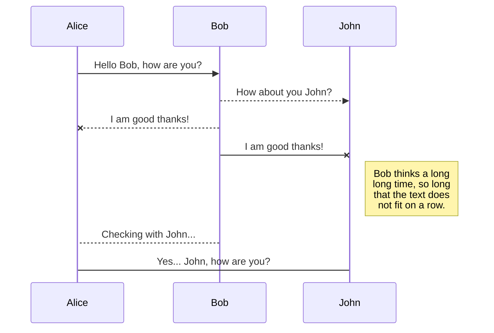

# Welcome to Generator
>created by [stackedit](https://stackedit.io/app#)

**About plugins**

- **gulp** - task manager [link](https://gulpjs.com/)
- **gulp-watch** - monitoring changes [link](https://www.npmjs.com/package/gulp-watch)
- **gulp-load-plugins** - for including all other plugins [link](https://www.npmjs.com/package/gulp-load-plugins)
- **gulp-plumber** - catch error
- **gulp-pug** - html preprocessor [link](https://pugjs.org/api/getting-started.html)
- **browser-sync** - auto browser reload when change [link](https://browsersync.io/)

>css plugin
- **gulp-sass** - css preprocessor [link](https://sass-lang.com/)
- **gulp-cssnano** - minify css [link](https://cssnano.co/guides/getting-started/)
- **gulp-autoprefixer** - auto css set pregix

*node-sass - was necessary install to for sass* 

- The file synchronization will keep one file of the workspace synced with one or multiple files in **Google Drive**, **Dropbox** or **GitHub**.
	>Before starting to sync files, you must link an account in the **Synchronize** sub-menu.


# Publication

Publishing in StackEdit makes it simple for you to publish online your files. Once you're happy with a file, you can publish it to different hosting platforms like **Blogger**, **Dropbox**, **Gist**, **GitHub**, **Google Drive**, **WordPress** and **Zendesk**. With [Handlebars templates](http://handlebarsjs.com/), you have full control over what you export.

> Before starting to publish, you must link an account in the **Publish** sub-menu.


## SmartyPants

SmartyPants converts ASCII punctuation characters into "smart" typographic punctuation HTML entities. For example:

|                |ASCII                          |HTML                         |
|----------------|-------------------------------|-----------------------------|
|Single backticks|`'Isn't this fun?'`            |'Isn't this fun?'            |
|Quotes          |`"Isn't this fun?"`            |"Isn't this fun?"            |
|Dashes          |`-- is en-dash, --- is em-dash`|-- is en-dash, --- is em-dash|


## KaTeX

You can render LaTeX mathematical expressions using [KaTeX](https://khan.github.io/KaTeX/):

The *Gamma function* satisfying $\Gamma(n) = (n-1)!\quad\forall n\in\mathbb N$ is via the Euler integral

$$
\Gamma(z) = \int_0^\infty t^{z-1}e^{-t}dt\,.
$$

> You can find more information about **LaTeX** mathematical expressions [here](http://meta.math.stackexchange.com/questions/5020/mathjax-basic-tutorial-and-quick-reference).


## UML diagrams

You can render UML diagrams using [Mermaid](https://mermaidjs.github.io/). For example, this will produce a sequence diagram:



And this will produce a flow chart:

```mermaid
graph LR
A[Square Rect] -- Link text --> B((Circle))
A --> C(Round Rect)
B --> D{Rhombus}
C --> D
```yandex test
